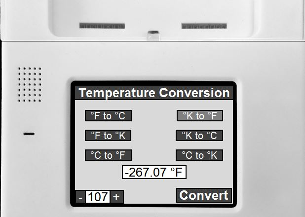

#Kinoma Practice

JokesAPI -
    Parsing a JSON from the xkcd api to get a comic strip image to display and then uses the title from 
    the comic strip to search the flickr api database for another image to display on button click.
    <a href="http://xkcd.com/">xkcd comics</a>&nbsp&nbsp<a href="https://www.flickr.com/services/api/">Flickr API</a>
    
TemperatureConverter -
    Converts temperatures between fahrenheit, celsius, and kelvin.
    

These project were created to practice the KinomaJS framework.
Created and tested using the Kinoma Studio IDE.